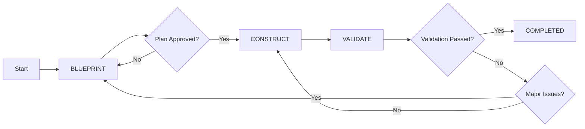

# ⚡ Workflow System Guide

This guide explains the AI-driven development methodology at the heart of the Cursor Rule Framework: **Blueprint → Construct → Validate** with automatic epic integration.

## ⚠️ Prerequisites

**CRITICAL**: Before using the workflow system, you must install the user rules template:

1. Open `.cursor/rules/user-rules-template.mdc`
2. Copy the entire file content
3. In Cursor IDE: **Settings** → **Features** → **Rules for AI** → **User Rules**
4. Paste the content into the User Rules field

**Without this setup, the AI-driven workflow system will not function correctly.**

## 🎯 Overview

The workflow system provides a structured approach to AI-assisted development that ensures quality, maintainability, and consistency. It's designed to work seamlessly with Cursor AI while maintaining human oversight at critical decision points.

## 🏗️ The Three-Phase Methodology

### **Phase 1: 🎯 Blueprint**
**Purpose**: Plan thoroughly with AI assistance before writing any code.

#### **What Happens**
- **Requirement Analysis**: Understand the problem and context
- **Architecture Validation**: Check existing architecture.mdc for patterns and constraints
- **Epic Context Integration**: Include epic requirements and acceptance criteria when available
- **Architecture Planning**: Design the solution structure that aligns with existing architecture
- **Implementation Strategy**: Create detailed step-by-step plan including architecture updates
- **Risk Assessment**: Identify potential challenges and solutions

#### **Phase Rules**
- ✅ **Planning and Design**: Create detailed implementation plans
- ✅ **Problem Analysis**: Understand requirements and constraints
- ✅ **Architecture Validation**: Review architecture.mdc for existing patterns and decisions
- ✅ **Epic Integration**: Include epic context and requirements when available
- ✅ **Architecture Discussion**: Design system structure and patterns
- ❌ **No Code Writing**: Implementation happens in Construct phase
- ❌ **No File Changes**: Only planning and documentation

#### **Deliverables**
```markdown
## Plan
### Implementation Steps
1. Create component structure in src/components/
2. Define TypeScript interfaces in types/
3. Implement core logic with error handling
4. Add comprehensive tests
5. Update documentation

### Architecture Decisions
- Use React functional components with hooks
- Implement state management with Context API
- Follow existing naming conventions
- Integrate with current testing framework

### Risk Mitigation
- Identify potential integration challenges
- Plan for error handling scenarios
- Define rollback strategies
```

#### **Example Blueprint Phase**

#### **User Request:**
```bash
"Add user authentication to the React app"
```

#### **AI Response (Blueprint Phase):**
```bash
"I'll help you add user authentication. Let me start by analyzing your current setup and creating a comprehensive plan.

## Current State Analysis
- React 18 with TypeScript
- No existing authentication system
- Uses Context API for state management
- Vitest + React Testing Library for testing

## Implementation Plan
1. **Authentication Context Setup**
   - Create AuthContext with login/logout/user state
   - Implement AuthProvider component
   - Add authentication types and interfaces

2. **Component Implementation**
   - LoginForm component with validation
   - ProtectedRoute wrapper component
   - User profile display component

3. **Integration**
   - Wrap App with AuthProvider
   - Update routing with protected routes
   - Add authentication state to navigation

4. **Testing Strategy**
   - Unit tests for auth context
   - Integration tests for login flow
   - Mock authentication API calls

Would you like me to proceed with this plan?"
```

### **Phase 2: 🔨 Construct**
**Purpose**: Implement the approved plan with AI pair programming.

#### **What Happens**
- **Code Implementation**: Write code following the approved plan
- **Architecture Updates**: Update architecture.mdc when implementing new patterns or decisions
- **Epic Progress Tracking**: Update epic status and progress when working on epic-related tasks
- **Iterative Development**: Build incrementally with frequent validation
- **Error Handling**: Address issues as they arise
- **Quality Assurance**: Apply coding standards and best practices

#### **Phase Rules**
- ✅ **Follow the Plan**: Implement exactly what was approved in Blueprint
- ✅ **Write Production Code**: Create fully functional, tested code
- ✅ **Update Architecture**: Document new patterns and decisions in architecture.mdc
- ✅ **Update Epic Progress**: Track progress on epic steps when applicable
- ✅ **Handle Errors**: Address compilation and runtime errors
- ✅ **Apply Standards**: Follow project coding conventions
- ❌ **No Plan Changes**: Major changes require return to Blueprint
- ❌ **No Shortcuts**: Maintain quality and completeness

#### **Implementation Pattern**
```bash
# Step-by-step execution
1. Implement core interfaces/types
2. Create main components/functions
3. Add error handling and validation
4. Write tests for new functionality
5. Update documentation
6. Validate each step before proceeding
```

#### **Error Handling**
```bash
# When errors occur during Construct:
1. Analyze the error and root cause
2. Apply immediate fix if it's a simple issue
3. Update plan if architectural change needed
4. Document decision and continue
5. Never leave broken code
```

#### **Example Construct Phase**
```typescript
// Step 1: Create authentication types
interface User {
  id: string
  email: string
  name: string
}

interface AuthContextValue {
  user: User | null
  login: (email: string, password: string) => Promise<void>
  logout: () => void
  isLoading: boolean
}

// Step 2: Implement AuthContext
const AuthContext = createContext<AuthContextValue | undefined>(undefined)

export function AuthProvider({ children }: { children: ReactNode }) {
  const [user, setUser] = useState<User | null>(null)
  const [isLoading, setIsLoading] = useState(false)

  const login = async (email: string, password: string) => {
    setIsLoading(true)
    try {
      // Implementation follows the plan...
    } catch (error) {
      // Error handling as planned...
    } finally {
      setIsLoading(false)
    }
  }

  // Continue implementation...
}
```

### **Phase 3: ✅ Validate**
**Purpose**: Ensure quality with AI-powered testing and validation.

#### **What Happens**
- **Functionality Testing**: Verify features work as intended
- **Quality Checks**: Run linting, formatting, type checking
- **Integration Testing**: Ensure components work together
- **Documentation Review**: Verify documentation is up to date

#### **Phase Rules**
- ✅ **Comprehensive Testing**: Run all relevant tests
- ✅ **Quality Gates**: Pass linting, formatting, type checks
- ✅ **Integration Validation**: Test feature in full context
- ✅ **Documentation Update**: Ensure docs reflect changes
- ❌ **No New Features**: Focus only on validation
- ❌ **No Major Refactoring**: Save for next Blueprint phase

#### **Validation Checklist**
```bash
# Technical Validation
- [ ] All tests pass (unit, integration, e2e)
- [ ] TypeScript compilation successful
- [ ] ESLint rules pass
- [ ] Prettier formatting applied
- [ ] No console errors or warnings

# Functional Validation  
- [ ] Feature works as specified in Blueprint
- [ ] Error handling behaves correctly
- [ ] User experience is smooth
- [ ] Performance is acceptable

# Documentation Validation
- [ ] README updated if needed
- [ ] Code comments are clear
- [ ] API documentation current
- [ ] Examples work correctly
```

#### **Example Validate Phase**
```bash
# Run comprehensive validation
npm test              # All tests pass
npm run type-check    # TypeScript validation
npm run lint          # ESLint passes
npm run format        # Prettier applied

# Manual testing
- ✅ Login form accepts valid credentials
- ✅ Protected routes redirect unauthenticated users
- ✅ User profile displays correctly
- ✅ Logout clears authentication state

# Documentation check
- ✅ Authentication setup documented
- ✅ Usage examples updated
- ✅ API documentation current
```

## 🤖 Automatic Integration Rules

### **Architecture Integration**
The workflow system automatically integrates with your project architecture:

- **RULE_ARCHITECTURE_VALIDATE_01**: During Blueprint phase, validates planned changes against existing architecture
- **RULE_ARCHITECTURE_UPDATE_01**: During Construct phase, updates architecture.mdc with new patterns and decisions
- **Architecture Conflict Resolution**: Handles simultaneous AI/user updates with timestamp-based conflict resolution

### **Epic Integration**
The workflow system seamlessly integrates with epic planning:

- **RULE_EPIC_UPDATE_01**: Automatically updates epic progress when workflow completes epic-related tasks
- **Epic Context Loading**: Automatically includes epic requirements and acceptance criteria in Blueprint phase
- **Natural Language Processing**: Interprets user requests to identify epic context and set workflow accordingly

### **Integration Benefits**
- **Consistency**: All development work aligns with existing architecture
- **Traceability**: Epic progress is automatically tracked through workflow completion
- **Knowledge Capture**: Architectural decisions are documented as they're made
- **Conflict Prevention**: Clear protocols for simultaneous AI/user updates

## 🔄 Workflow State Management

### **State Tracking**
The workflow system tracks its current state in `workflow-state.mdc`:

```yaml
## State
Phase: BLUEPRINT | CONSTRUCT | VALIDATE
Status: READY | IN_PROGRESS | BLOCKED | COMPLETED
CurrentItem: [Current task or epic being worked on]
```

### **State Transitions**


### **Phase Guidelines**

#### **When to Move Between Phases**
- **Blueprint → Construct**: Plan is detailed, approved, and actionable
- **Construct → Validate**: Implementation is complete per the plan
- **Validate → Blueprint**: Major issues require re-planning
- **Validate → Construct**: Minor fixes needed
- **Validate → Complete**: All validation passes

#### **When to Return to Previous Phases**
- **Construct → Blueprint**: Fundamental design issues discovered
- **Validate → Construct**: Implementation bugs or missing features
- **Validate → Blueprint**: Requirements or architecture need changes

## 🛠️ Practical Usage

### **Starting a New Feature**
```bash
# 1. Set workflow to Blueprint phase
"Let's plan the user profile editing feature"

# AI enters Blueprint phase, analyzes requirements
# Creates detailed implementation plan
# Asks for approval before proceeding

# 2. Approve and move to Construct
"The plan looks good, please implement it"

# AI enters Construct phase
# Implements exactly what was planned
# Handles errors and edge cases

# 3. Automatic validation
# AI automatically moves to Validate phase
# Runs tests, checks quality, verifies functionality
```

### **Handling Interruptions**
```bash
# If work is interrupted, state is preserved
## State
Phase: CONSTRUCT
Status: IN_PROGRESS
CurrentItem: USER_PROFILE_EDITING_FEATURE

## Plan
[Detailed plan preserved]

## Log
[Progress log maintained]

# When resuming, AI knows exactly where it left off
```

### **Team Collaboration**
```bash
# Team member can see current state
## State  
Phase: VALIDATE
Status: READY
CurrentItem: PAYMENT_INTEGRATION

# Understanding what's happening and what's next
# Can provide input or take over seamlessly
```

## 🚨 Common Patterns and Solutions

### **Blueprint Phase Challenges**

#### **Unclear Requirements**

**Problem:** Vague or incomplete requirements  
**Solution:** AI asks clarifying questions

#### **User Request:**
```bash
"Add authentication to the app"
```

#### **AI Response:**
```bash
"I need more details about the user authentication:
- What authentication method? (email/password, OAuth, etc.)
- Do you need password reset functionality?
- Should users stay logged in between sessions?
- Any specific security requirements?"
```

#### **Large Feature Scope**

**Problem:** Feature too big for single implementation  
**Solution:** Break into smaller, manageable pieces

#### **User Request:**
```bash
"Build a complete e-commerce system with user accounts, product catalog, shopping cart, payment processing, and admin dashboard"
```

#### **AI Response:**
```bash
"This feature is quite large. I recommend breaking it into phases:
1. Basic login/logout (this sprint)
2. Password reset (next sprint)  
3. Social OAuth (future sprint)
4. Two-factor authentication (future sprint)"
```

### **Construct Phase Challenges**

#### **Plan Doesn't Match Reality**

**Problem:** Implementation reveals plan issues  
**Solution:** Document and return to Blueprint

#### **AI Response during Construct:**
```bash
"During implementation, I discovered the existing API doesn't support 
the planned authentication flow. I need to revise the plan to work 
with the current backend constraints."
```

#### **Unexpected Errors**

**Problem:** Technical issues during implementation  
**Solution:** Handle incrementally, document decisions

#### **AI Response during Construct:**
```bash
"Encountered TypeScript error with the Context pattern. 
Applying alternative approach using custom hook pattern 
as discussed in project patterns. Continuing with implementation."
```

### **Validate Phase Challenges**

#### **Tests Failing**

**Problem:** Tests don't pass after implementation  
**Solution:** Fix issues or return to appropriate phase

#### **AI Response during Validate:**
```bash
"Two tests are failing due to missing mock setup. 
Fixing the test configuration and updating mocks 
to match the new authentication flow."
```

#### **Performance Issues**

**Problem:** Feature works but has performance problems  
**Solution:** Optimize or plan performance improvements

#### **AI Response during Validate:**
```bash
"Feature functions correctly but causes re-renders. 
Adding useMemo optimization to the authentication context 
to prevent unnecessary component updates."
```

## 📈 Advanced Workflow Patterns

### **Epic-Level Planning**
For large initiatives, workflow automatically integrates with epic planning:

```bash
# User requests epic work with natural language
User: "Start working on the login component from the user management epic"

# AI automatically:
1. Searches epics.mdc for matching epic and step
2. Sets workflow context with epic reference
3. Includes epic requirements during blueprint phase
4. Updates epic progress when workflow completes

# Epic-workflow integration is AI-driven:
Epic: User Management System
├── Phase 1: Authentication (AI manages workflow integration)
├── Phase 2: User Profiles (AI tracks progress automatically)
├── Phase 3: Admin Panel (AI updates epic status)
```

### **Iterative Development**
Use workflow phases for iterative improvement:

```bash
# Iteration 1: Basic functionality
Blueprint → Construct → Validate

# Iteration 2: Enhanced features  
Blueprint → Construct → Validate

# Iteration 3: Performance optimization
Blueprint → Construct → Validate
```

### **Team Workflows**
Coordinate team development with shared state:

```bash
# Developer A works on auth
Phase: CONSTRUCT
CurrentItem: USER_AUTHENTICATION

# Developer B plans next feature
Phase: BLUEPRINT  
CurrentItem: USER_PROFILE_MANAGEMENT

# Team sees coordinated progress
```

## 🔧 Configuration and Customization

### **Adapting Phases for Your Project**
```markdown
# Example: Modify for your specific needs
[PHASE: DESIGN] - UI/UX design phase
[PHASE: BLUEPRINT] - Technical planning  
[PHASE: CONSTRUCT] - Implementation
[PHASE: REVIEW] - Code review phase
[PHASE: VALIDATE] - Testing and QA
```

### **Custom Quality Gates**
```markdown
# Add project-specific validation steps
## Validation Checklist
- [ ] Security review completed
- [ ] Performance benchmarks met
- [ ] Accessibility standards followed
- [ ] Database migration tested
- [ ] API documentation updated
```

### **Integration with Tools**
```bash
# Connect workflow to your tools
- CI/CD pipelines trigger on Validate phase
- Project management tools track workflow state  
- Monitoring systems validate performance
- Documentation systems update automatically
```

## 📞 Need Help?

- **Workflow Issues**: See [Troubleshooting Guide](troubleshooting.md)
- **Custom Patterns**: Check [Custom Rules](custom-rules.md)
- **Team Setup**: Read [Team Integration](team-integration.md)

---

*The workflow system is the engine that makes "Vibe Coding" possible - ensuring quality development through structured AI assistance.* 