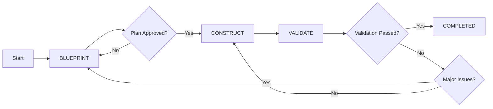

# ⚡ Workflow System Guide v2

This guide explains the **enhanced AI-driven development methodology** at the heart of the Cursor Rule Framework v2: **Blueprint → Construct → Validate** with comprehensive epic and architecture integration.

## 🆕 What's New in v2 Workflow System

### **Enhanced Features**
- **Workflow Lifecycle Rules (`workflow-lifecycle-rules.mdc`)**: Comprehensive automation and phase management
- **Architecture Integration**: Automatic coordination with modular architecture framework
- **Epic-Workflow Coordination**: Seamless integration with 7-component epic management system
- **Technology-Agnostic Patterns**: Workflow patterns that work with any programming language or framework
- **Automated Quality Gates**: Enhanced validation with architecture compliance checking
- **State Management Automation**: Advanced workflow state tracking and coordination

### **v2 Integration Points**
- **Epic Management**: Automatic epic context and progress tracking
- **Architecture Framework**: Automatic architecture validation and documentation updates
- **Validation Automation**: Automated consistency checking across all framework components

## ⚠️ Prerequisites

**CRITICAL**: Before using the v2 workflow system, you must install the enhanced user rules template:

1. Open `.cursor/rules/rule-framework-v2/user-rules-template.mdc`
2. Copy the entire file content
3. In Cursor IDE: **Settings** → **Features** → **Rules for AI** → **User Rules**
4. Paste the content into the User Rules field

**Without this setup, the v2 AI-driven workflow system will not function correctly.**

## 🎯 Overview

The v2 workflow system provides a structured, technology-agnostic approach to AI-assisted development that ensures quality, maintainability, and architectural consistency. It's designed to work seamlessly with Cursor AI while maintaining human oversight at critical decision points and coordinating with the comprehensive epic and architecture management systems.

## 🏗️ Enhanced Three-Phase Methodology

### **Phase 1: 🎯 Blueprint (Enhanced)**
**Purpose**: Plan thoroughly with AI assistance, architecture validation, and epic coordination before writing any code.

#### **What Happens**
- **Requirement Analysis**: Understand the problem and context (technology-agnostic)
- **Architecture Framework Integration**: Check `architecture/core/patterns.mdc` and relevant domain patterns
- **Epic Context Integration**: Include epic requirements, progress tracking, and architecture impact assessment
- **Technology-Agnostic Planning**: Design solutions that work across technology stacks when possible
- **Architecture Decision Planning**: Plan ADRs when architectural decisions are needed
- **Implementation Strategy**: Create detailed step-by-step plan including architecture updates
- **Risk Assessment**: Identify potential challenges and technology-specific solutions

#### **Enhanced Phase Rules**
- ✅ **Planning and Design**: Create detailed, technology-aware implementation plans
- ✅ **Problem Analysis**: Understand requirements and multi-technology constraints
- ✅ **Architecture Framework Validation**: Review architecture framework for existing patterns and decisions
- ✅ **Epic Integration**: Include epic context, progress tracking, and architecture coordination
- ✅ **Technology-Agnostic Architecture**: Design patterns that work across technology stacks
- ✅ **ADR Planning**: Plan Architecture Decision Records when needed
- ❌ **No Code Writing**: Implementation happens in Construct phase
- ❌ **No File Changes**: Only planning and documentation

#### **Enhanced Deliverables**
```markdown
## v2 Implementation Plan

### Epic Context
- **Epic**: MULTI_PLATFORM_USER_SYSTEM
- **Phase**: Phase 1 - Core Authentication Foundation
- **Step**: Authentication Architecture Design
- **Architecture Impact**: Medium (new security patterns, API evolution)

### Architecture Integration
- **Domains Affected**: Backend Security, API Design, Frontend State Management
- **Patterns to Document**: Token-based authentication flow, API security patterns
- **ADRs to Create**: Authentication Strategy Selection, JWT vs Session-Based Authentication
- **Technology Files to Update**: backend-node.mdc, frontend-react.mdc (in root directory)

### Technology-Agnostic Implementation Steps
1. **Authentication Pattern Design** (universal patterns)
   - Document JWT token strategy (works with any backend/frontend)
   - Define API contract specifications (technology-portable)
   - Create security architecture integration patterns

2. **Technology-Specific Implementation** (React + Node.js)
   - Backend authentication middleware (Node.js patterns)
   - Frontend authentication components (React patterns)
   - Database integration (PostgreSQL patterns)

3. **Architecture Documentation Updates**
   - Update architecture/core/patterns.mdc with authentication patterns
   - Create ADRs in architecture/decisions/
   - Update domain-specific files

### Epic Progress Coordination
- Update epic-active.mdc with step progress
- Coordinate with epic-architecture-integration.mdc
- Track architecture impact in epic registry

### Risk Mitigation
- Plan for technology migration scenarios
- Define architecture evolution strategies
- Consider cross-platform authentication requirements
```

#### **Example v2 Blueprint Phase**

#### **User Request:**
```bash
"Add user authentication that works with our React frontend and Node.js backend, coordinated with our User Management epic"
```

#### **AI v2 Response (Enhanced Blueprint Phase):**
```bash
"I'll help you add user authentication following v2 framework patterns. Let me start by analyzing your current setup, coordinating with the epic system, and creating a comprehensive plan.

## Epic Context Analysis
- **Current Epic**: MULTI_PLATFORM_USER_SYSTEM (Phase 1, Step 2)
- **Epic Progress**: 35% (2 of 6 steps completed)
- **Architecture Impact**: Authentication patterns affect Backend, Frontend, Security domains

## Current State Analysis (Technology-Agnostic + Specific)
- **Frontend**: React 18 with TypeScript (technology-specific patterns available)
- **Backend**: Node.js with Express (technology-specific patterns available)
- **Architecture Status**: Core patterns documented, authentication patterns needed
- **Epic Coordination**: Step aligns with epic authentication foundation phase

## v2 Implementation Plan

### 1. Architecture Pattern Development (Universal)
- Document JWT-based authentication flow (technology-agnostic)
- Create API security patterns (works with any backend/frontend combination)
- Define authentication state management patterns (universal concepts)

### 2. Technology-Specific Implementation
- **Backend (Node.js)**: Authentication middleware, JWT generation/validation
- **Frontend (React)**: Authentication components, state management, route protection
- **Integration**: Token flow between React and Node.js

### 3. Architecture Framework Updates
- **Create ADR**: "Authentication Strategy Selection - JWT vs Session-Based"
- **Update Core Patterns**: Add authentication flow to architecture/core/patterns.mdc
- **Update Domain Files**: Backend and frontend specific authentication patterns

### 4. Epic Coordination
- Update epic-active.mdc with step progress
- Track architecture impact in epic-architecture-integration.mdc
- Coordinate with Phase 1 completion goals

Would you like me to proceed with this enhanced v2 plan?"
```

### **Phase 2: 🔨 Construct (Enhanced)**
**Purpose**: Implement the approved plan with AI pair programming, architecture updates, and epic coordination.

#### **What Happens**
- **Code Implementation**: Write code following the approved plan (technology-aware)
- **Architecture Framework Updates**: Update relevant architecture files when implementing new patterns
- **Epic Progress Tracking**: Update epic system with real-time progress and architecture coordination
- **Technology-Specific Pattern Application**: Apply technology-specific patterns from custom files in root directory
- **ADR Creation**: Create Architecture Decision Records when planned
- **Cross-Technology Coordination**: Ensure patterns work across different technology stacks
- **Quality Assurance**: Apply coding standards and architectural consistency

#### **Enhanced Phase Rules**
- ✅ **Follow the Enhanced Plan**: Implement exactly what was approved in Blueprint with architecture coordination
- ✅ **Write Production Code**: Create fully functional, tested, architecturally consistent code
- ✅ **Update Architecture Framework**: Document new patterns in appropriate architecture files
- ✅ **Create ADRs**: Document architectural decisions as planned
- ✅ **Update Epic Progress**: Track progress and coordinate with epic management system
- ✅ **Apply Technology Patterns**: Use technology-specific patterns from custom files in root directory
- ✅ **Ensure Cross-Technology Compatibility**: Design patterns for technology migration readiness
- ❌ **No Plan Changes**: Major changes require return to Blueprint
- ❌ **No Architecture Shortcuts**: Maintain architectural consistency and documentation

#### **v2 Implementation Pattern**
```bash
# Enhanced step-by-step execution with architecture coordination
1. **Architecture Pattern Creation**
   - Document universal patterns in architecture/core/patterns.mdc
   - Create relevant ADRs in architecture/decisions/
   
2. **Technology-Specific Implementation**
   - Apply technology patterns from custom files in root directory
   - Implement backend components (Node.js patterns)
   - Implement frontend components (React patterns)
   
3. **Epic Coordination**
   - Update epic-active.mdc with step progress
   - Update epic-architecture-integration.mdc with architecture impact
   
4. **Quality Validation**
   - Test implementation against epic acceptance criteria
   - Validate architecture consistency
   - Ensure cross-technology compatibility

5. **Documentation Updates**
   - Update domain-specific architecture files
   - Update epic progress tracking
   - Validate against architecture maintenance rules
```

### **Phase 3: ✅ Validate (Enhanced)**
**Purpose**: Ensure quality with AI-powered testing, architecture validation, and epic coordination.

#### **What Happens**
- **Functionality Testing**: Verify features work as intended (technology-specific)
- **Architecture Validation**: Ensure compliance with architecture framework
- **Epic Success Criteria Validation**: Verify epic requirements are met
- **Cross-Technology Compatibility**: Test patterns work across technology stacks
- **Quality Gates**: Run technology-specific linting, formatting, type checking
- **Integration Testing**: Ensure components work together across technology boundaries
- **Documentation Validation**: Verify architecture and epic documentation is updated

#### **Enhanced Phase Rules**
- ✅ **Comprehensive Testing**: Run all relevant tests (technology-specific and integration)
- ✅ **Architecture Compliance**: Validate against architecture framework rules
- ✅ **Epic Validation**: Verify epic success criteria and progress tracking
- ✅ **Quality Gates**: Pass technology-specific quality checks
- ✅ **Cross-Technology Testing**: Ensure patterns work across technology stacks
- ✅ **Documentation Validation**: Verify architecture and epic documentation updates
- ❌ **No New Features**: Focus only on validation
- ❌ **No Major Refactoring**: Save for next Blueprint phase

#### **v2 Validation Checklist**
```markdown
## Enhanced Validation Checklist

### Epic Coordination Validation
- [ ] Epic step marked as completed in epic-active.mdc
- [ ] Epic progress updated in epic-registry.mdc
- [ ] Architecture impact documented in epic-architecture-integration.mdc
- [ ] Epic success criteria validation passed

### Architecture Framework Validation
- [ ] New patterns documented in architecture/core/patterns.mdc
- [ ] ADRs created in architecture/decisions/ as planned
- [ ] Technology-specific patterns updated in custom files in root directory
- [ ] Architecture maintenance rules compliance validated

### Technology-Specific Validation
- [ ] Backend tests passing (Node.js specific)
- [ ] Frontend tests passing (React specific)
- [ ] Integration tests across technology boundaries
- [ ] Technology-specific quality gates passed

### Cross-Technology Compatibility
- [ ] Patterns documented for technology migration scenarios
- [ ] API contracts designed for multiple frontend technologies
- [ ] Authentication flow works with multiple client types
```

## 📊 v2 Workflow Integration Components

### **Workflow Lifecycle Rules (`workflow-lifecycle-rules.mdc`)**
Comprehensive automation and phase management:

```markdown
## Phase Transition Rules
- Blueprint → Construct: Requires approved plan and architecture validation
- Construct → Validate: Requires implementation completion and architecture updates
- Validate → Complete: Requires all quality gates and epic coordination

## Automation Triggers
- Epic progress updates: Automatic when workflow steps complete
- Architecture updates: Automatic when new patterns are implemented
- Quality validation: Automatic when validate phase initiates
```

### **Epic-Workflow Coordination**
Seamless integration with epic management system:

```markdown
## Current Workflow Context
- **Epic**: MULTI_PLATFORM_USER_SYSTEM
- **Phase**: Phase 1 - Core Authentication Foundation
- **Step**: Backend Authentication Service Implementation
- **Architecture Domains**: Backend Security, API Design
- **Progress**: 45% (Step 2 of 4 in Phase 1)
```

### **Architecture-Workflow Integration**
Automatic coordination with architecture framework:

```markdown
## Architecture Impact Tracking
- **Patterns Created**: JWT Authentication Flow (universal)
- **ADRs Generated**: 2 (Authentication Strategy, API Security Design)
- **Domain Updates**: backend-node.mdc, frontend-react.mdc
- **Compliance Status**: Validated against architecture maintenance rules
```

## 🎯 v2 Advanced Workflow Patterns

### **Multi-Technology Workflow Coordination**
```bash
# Example: Authentication across React, Vue, and React Native
## Blueprint Phase
- Plan universal authentication patterns
- Design technology-specific implementations
- Coordinate across multiple domain files

## Construct Phase  
- Implement universal API patterns
- Create React-specific components
- Create Vue-specific components  
- Create React Native patterns

## Validate Phase
- Test cross-technology compatibility
- Validate universal pattern effectiveness
- Ensure epic success criteria across all technologies
```

### **Epic-Driven Workflow Execution**
```bash
# Workflow automatically coordinates with epic system
## Epic Context Integration
- Epic requirements automatically included in Blueprint planning
- Epic progress automatically updated during Construct
- Epic success criteria automatically validated in Validate phase

## Architecture Impact Coordination
- Epic architecture impact automatically tracked
- Architecture domain updates coordinated with epic progress
- Cross-epic pattern sharing automatically managed
```

### **Architecture Evolution Through Workflow**
```bash
# Workflow drives architecture documentation evolution
## Pattern Discovery
- New patterns discovered during implementation
- Universal patterns extracted and documented
- Technology-specific patterns organized by domain

## ADR Creation
- Architectural decisions documented during workflow execution
- Decision context captured from epic and workflow state
- Cross-technology decision implications tracked
```

---

**v2 Workflow Advantage**: The enhanced workflow system provides comprehensive coordination between development phases, epic management, and architecture evolution, enabling efficient AI-assisted development that maintains consistency across complex multi-technology projects.

## 🤖 Automatic Integration Rules

### **Architecture Integration**
The workflow system automatically integrates with your project architecture:

- **RULE_ARCHITECTURE_VALIDATE_01**: During Blueprint phase, validates planned changes against existing architecture
- **RULE_ARCHITECTURE_UPDATE_01**: During Construct phase, updates architecture.mdc with new patterns and decisions
- **Architecture Conflict Resolution**: Handles simultaneous AI/user updates with timestamp-based conflict resolution

### **Epic Integration**
The workflow system seamlessly integrates with epic planning:

- **RULE_EPIC_UPDATE_01**: Automatically updates epic progress when workflow completes epic-related tasks
- **Epic Context Loading**: Automatically includes epic requirements and acceptance criteria in Blueprint phase
- **Natural Language Processing**: Interprets user requests to identify epic context and set workflow accordingly

### **Integration Benefits**
- **Consistency**: All development work aligns with existing architecture
- **Traceability**: Epic progress is automatically tracked through workflow completion
- **Knowledge Capture**: Architectural decisions are documented as they're made
- **Conflict Prevention**: Clear protocols for simultaneous AI/user updates

## 🔄 Workflow State Management

### **State Tracking**
The workflow system tracks its current state in `workflow-state.mdc`:

```yaml
## State
Phase: BLUEPRINT | CONSTRUCT | VALIDATE
Status: READY | IN_PROGRESS | BLOCKED | COMPLETED
CurrentItem: [Current task or epic being worked on]
```

### **State Transitions**


### **Phase Guidelines**

#### **When to Move Between Phases**
- **Blueprint → Construct**: Plan is detailed, approved, and actionable
- **Construct → Validate**: Implementation is complete per the plan
- **Validate → Blueprint**: Major issues require re-planning
- **Validate → Construct**: Minor fixes needed
- **Validate → Complete**: All validation passes

#### **When to Return to Previous Phases**
- **Construct → Blueprint**: Fundamental design issues discovered
- **Validate → Construct**: Implementation bugs or missing features
- **Validate → Blueprint**: Requirements or architecture need changes

## 🛠️ Practical Usage

### **Starting a New Feature**
```bash
# 1. Set workflow to Blueprint phase
"Let's plan the user profile editing feature"

# AI enters Blueprint phase, analyzes requirements
# Creates detailed implementation plan
# Asks for approval before proceeding

# 2. Approve and move to Construct
"The plan looks good, please implement it"

# AI enters Construct phase
# Implements exactly what was planned
# Handles errors and edge cases

# 3. Automatic validation
# AI automatically moves to Validate phase
# Runs tests, checks quality, verifies functionality
```

### **Handling Interruptions**
```bash
# If work is interrupted, state is preserved
## State
Phase: CONSTRUCT
Status: IN_PROGRESS
CurrentItem: USER_PROFILE_EDITING_FEATURE

## Plan
[Detailed plan preserved]

## Log
[Progress log maintained]

# When resuming, AI knows exactly where it left off
```

### **Team Collaboration**
```bash
# Team member can see current state
## State  
Phase: VALIDATE
Status: READY
CurrentItem: PAYMENT_INTEGRATION

# Understanding what's happening and what's next
# Can provide input or take over seamlessly
```

## 🚨 Common Patterns and Solutions

### **Blueprint Phase Challenges**

#### **Unclear Requirements**

**Problem:** Vague or incomplete requirements  
**Solution:** AI asks clarifying questions

#### **User Request:**
```bash
"Add authentication to the app"
```

#### **AI Response:**
```bash
"I need more details about the user authentication:
- What authentication method? (email/password, OAuth, etc.)
- Do you need password reset functionality?
- Should users stay logged in between sessions?
- Any specific security requirements?"
```

#### **Large Feature Scope**

**Problem:** Feature too big for single implementation  
**Solution:** Break into smaller, manageable pieces

#### **User Request:**
```bash
"Build a complete e-commerce system with user accounts, product catalog, shopping cart, payment processing, and admin dashboard"
```

#### **AI Response:**
```bash
"This feature is quite large. I recommend breaking it into phases:
1. Basic login/logout (this sprint)
2. Password reset (next sprint)  
3. Social OAuth (future sprint)
4. Two-factor authentication (future sprint)"
```

### **Construct Phase Challenges**

#### **Plan Doesn't Match Reality**

**Problem:** Implementation reveals plan issues  
**Solution:** Document and return to Blueprint

#### **AI Response during Construct:**
```bash
"During implementation, I discovered the existing API doesn't support 
the planned authentication flow. I need to revise the plan to work 
with the current backend constraints."
```

#### **Unexpected Errors**

**Problem:** Technical issues during implementation  
**Solution:** Handle incrementally, document decisions

#### **AI Response during Construct:**
```bash
"Encountered TypeScript error with the Context pattern. 
Applying alternative approach using custom hook pattern 
as discussed in project patterns. Continuing with implementation."
```

### **Validate Phase Challenges**

#### **Tests Failing**

**Problem:** Tests don't pass after implementation  
**Solution:** Fix issues or return to appropriate phase

#### **AI Response during Validate:**
```bash
"Two tests are failing due to missing mock setup. 
Fixing the test configuration and updating mocks 
to match the new authentication flow."
```

#### **Performance Issues**

**Problem:** Feature works but has performance problems  
**Solution:** Optimize or plan performance improvements

#### **AI Response during Validate:**
```bash
"Feature functions correctly but causes re-renders. 
Adding useMemo optimization to the authentication context 
to prevent unnecessary component updates."
```

## 📈 Advanced Workflow Patterns

### **Epic-Level Planning**
For large initiatives, workflow automatically integrates with epic planning:

```bash
# User requests epic work with natural language
User: "Start working on the login component from the user management epic"

# AI automatically:
1. Searches epics.mdc for matching epic and step
2. Sets workflow context with epic reference
3. Includes epic requirements during blueprint phase
4. Updates epic progress when workflow completes

# Epic-workflow integration is AI-driven:
Epic: User Management System
├── Phase 1: Authentication (AI manages workflow integration)
├── Phase 2: User Profiles (AI tracks progress automatically)
├── Phase 3: Admin Panel (AI updates epic status)
```

### **Iterative Development**
Use workflow phases for iterative improvement:

```bash
# Iteration 1: Basic functionality
Blueprint → Construct → Validate

# Iteration 2: Enhanced features  
Blueprint → Construct → Validate

# Iteration 3: Performance optimization
Blueprint → Construct → Validate
```

### **Team Workflows**
Coordinate team development with shared state:

```bash
# Developer A works on auth
Phase: CONSTRUCT
CurrentItem: USER_AUTHENTICATION

# Developer B plans next feature
Phase: BLUEPRINT  
CurrentItem: USER_PROFILE_MANAGEMENT

# Team sees coordinated progress
```

## 🔧 Configuration and Customization

### **Adapting Phases for Your Project**
```markdown
# Example: Modify for your specific needs
[PHASE: DESIGN] - UI/UX design phase
[PHASE: BLUEPRINT] - Technical planning  
[PHASE: CONSTRUCT] - Implementation
[PHASE: REVIEW] - Code review phase
[PHASE: VALIDATE] - Testing and QA
```

### **Custom Quality Gates**
```markdown
# Add project-specific validation steps
## Validation Checklist
- [ ] Security review completed
- [ ] Performance benchmarks met
- [ ] Accessibility standards followed
- [ ] Database migration tested
- [ ] API documentation updated
```

### **Integration with Tools**
```bash
# Connect workflow to your tools
- CI/CD pipelines trigger on Validate phase
- Project management tools track workflow state  
- Monitoring systems validate performance
- Documentation systems update automatically
```

## 📞 Need Help?

- **Workflow Issues**: See [Troubleshooting Guide](troubleshooting.md)
- **Custom Patterns**: Check [Custom Rules](custom-rules.md)
- **Team Setup**: Read [Team Integration](team-integration.md)

---

*The workflow system is the engine that makes "Vibe Coding" possible - ensuring quality development through structured AI assistance.* 